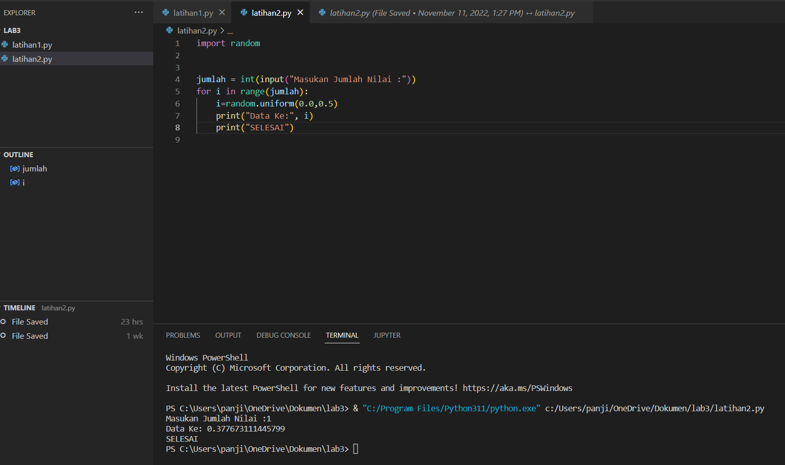

# praktikum4

## MEMBUAT PROGRAM DENGAN PERULANGAN BERTINGKAT
### Source Code & Output (Hasil Running Program)
Berikut ini adalah Source Code Latihan 3 :

start = 0; stop = 10; for i in range(10): for j in range(start,stop): print(j, sep=" ", end=" ") if j < 10 : print('{0:>2}'.format(""), end="") else : print('{0:>1}'.format(""), end="") start+=1 stop+=1 print("")
- gambar

## MEMBUAT PROGRAM BILANGAN ACAK YANG LEBIH KECIL DARI 0.5 MENGGUNAKAN KOMBINASI WHILE DAN FOR
### Source Code & Output (Hasil Running Program)
Berikut ini adalah Source Code LATIHAN 4 :

import random

jumlah = int(input("Masukan Jumlah Nilai :")) for i in range(jumlah): i=random.uniform(0.0,0.5) print("Data Ke:", i) print("Selesai") 
- gambar

